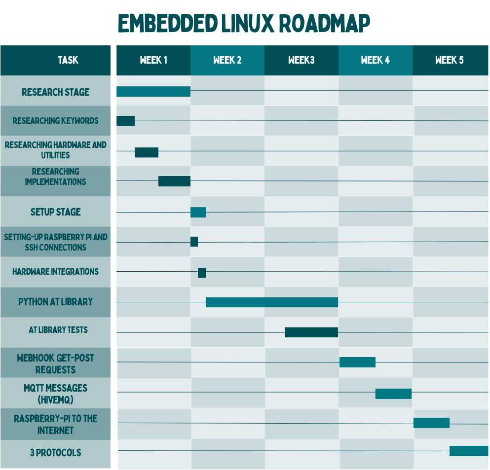

# Embedded Linux Internship

This repository will be used to keep track of the progress made during the internship on a weekly basis.

## Table of Contents
- [Embedded Linux Internship](#embedded-linux-internship)
  - [Table of Contents](#table-of-contents)
  - [Project](#project)
  - [Gantt Chart](#gantt-chart)
  - [Roadmap](#roadmap)
    - [(-) / 14 December ✔️](#---14-december-️)
    - [14 December / 21 December ✔️](#14-december--21-december-️)
    - [21 December / 28 December](#21-december--28-december)
    - [28 December / 4 January](#28-december--4-january)
    - [4 January / 11 January](#4-january--11-january)
    - [11 January / 18 January](#11-january--18-january)

## Project

You can see the project instructions [here](Project/Project.md).

## Gantt Chart

## Roadmap

###  [(-) / 14 December](Weekly/Week_0/Week_0.md) ✔️
- Creating GitHub repository ✔️
- Making roadmap ✔️
- Creating Gantt Chart ✔️

### [14 December / 21 December](Weekly/Week_1/Week_1.md) ✔️
-	<u>Research Stage</u> ✔️
-	Researching keywords ✔️
-	Researching hardware and utilities ✔️
-	Researching implementations ✔️
-	<u>Setup Stage</u> ✔️
-	Setting-up Raspberry Pi ✔️
-	Setting-up SSH connections ✔️
-	Hardware integrations ✔️

### [21 December / 28 December](Weekly/Week_2/Week_2.md)
-	<u>Developing Python AT Library</u>

### 28 December / 4 January
-  <u>Developing Python AT Library</u>
-	Tests (depends on workload)

### 4 January / 11 January
-	<u>Webhook Get-Post requests</u>
-	<u>MQTT messages (hivemq)</u>
-	[Final Exams]

### 11 January / 18 January
-  <u>Connecting Raspberry-Pi to the internet via a modem</u>
-  3 Protocols will be tested
   -  PPP protocol
   -  QMI/RMNET protocol
   -  ECM protocol

 

> [!NOTE]
> Timelines can be updated (Especially after [Research Stage](#14-december--21-december)) depending on workload.