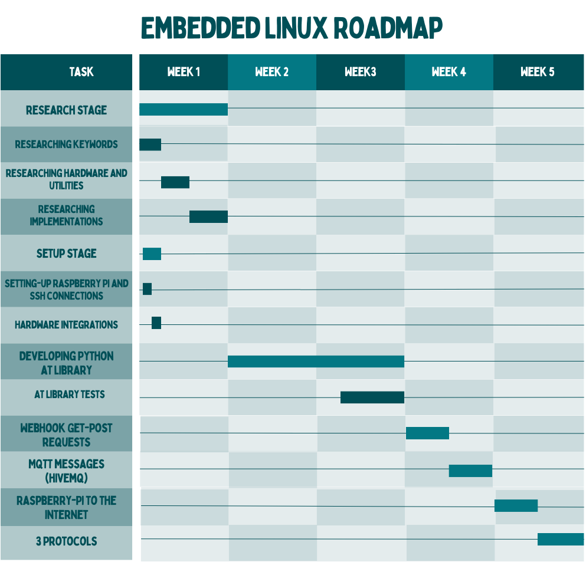

# Week 1

## Week 1 Responsibilites
* Learning basic git commands.
* Creating a github repository where the work will be done.
* Learning how to create a document with Markdown.
* Raspberry Pi 3B+ initial installations, getting the operating system ready, learning basic bash commands.
* Preparation of the Gantt chart. You should add this chart to the github repository in a viewable format.

> [!NOTE]
> Because of I already know git commands and creating a markdown document I've mostly focused on Gantt Chart.

## Gantt Chart

I've learned that A Gantt chart is a visual timeline that shows tasks and their timelines in a project. It helps with planning and tracking progress.

I've also noticed during my researches that you can create Gantt Chart structure using Github Projects section. I didn't have time to try this by myself 

I've watched the following videos and researched on the internet to get more details about Gantt Charts:

- [What is a Gantt Chart?](https://www.youtube.com/watch?v=4DSV-_2pqmI&ab_channel=AdrianaGirdler)
- [How to Create a Gantt Chart in 9 Easy Steps](https://www.youtube.com/watch?v=FX70rWEE8eY&t=17s&ab_channel=OnlinePMCourses-MikeClayton)
- [Project Management in Under 5: What is a Gantt Chart?](https://www.youtube.com/watch?v=fB0wsdmV3Sw&ab_channel=OnlinePMCourses-MikeClayton)
- [Gantt Viewer for Github Project Demo Show](https://www.youtube.com/watch?v=XPHTV0f83QM&ab_channel=HaoHuo)
- [You can create a Gantt Chart from issues in GitHub projects](https://www.reddit.com/r/github/comments/114jego/you_can_create_a_gantt_chart_from_issues_in/)

## My Roadmap Gannt Chart

## End of the Week

This week I had another school project deadline so I couldn't spend the exact time I planned for this week. But in the next week I'll start the `Research Stage` and I'll begin to obtain more detailed information about the project.