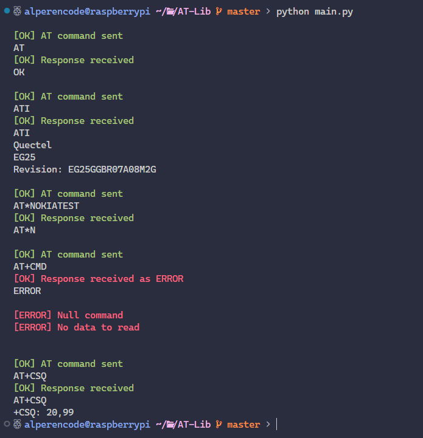
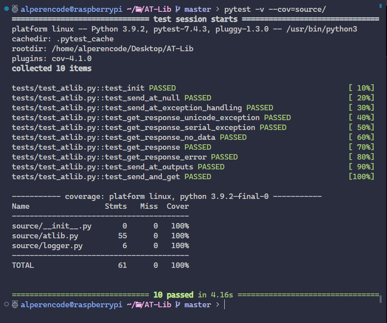

# Week 2

## Week 2 Plan

- <u>[Python AT-Library](https://github.com/Alperencode/AT-Lib)</u> 
  - [Summary](#summary)
  - [Set-up](#set-up)
  - [Develop](#develop)
  - [To-do](#to-do)
  - [Notes](#notes)
  - [Sample Images and Code Snippets](#samples)


## Summary

This week I've started to develop [AT-Library](https://github.com/Alperencode/AT-Lib) with python. First I created my workspace, repository, project folder structure, and workflow for GitHub actions. Then I started to develop AT-Library starting from creating the most important class named `ATLIB` which will provide most of the methods. While creating the class and its methods I've read so many documents and blog posts to use modules properly and efficiently to not slow down my program. After finishing the essential functions and making sure they were working, I started to write its tests. During writing tests, I realized that I had so many things to fix and improve. So I fixed the bugs and improved the methods according to test cases and completed the coverage. 

## Python AT Library

<hr>

## Set-up

First of all I configured my workspace

- Set up SSH extension for VSCode
- Create `AT-Lib` repository
- Add `AT-Lib` as submodule to this repository
- Create main directory structure for `AT-Lib`
  - Initialize tests and source directories
  - Add workflow folder for GitHub actions
    - Add linting and tests actions
    - Sample image [here](#workflow-snippet)

<br><hr>

## Develop

First, I've started to build class named `ATLIB` which will allow following operations:

- Constructor for creating Serial class object ✔️
- Find valid port ✔️
  - Code snippet [here](#get-port-function)
- Open serial connection ✔️
- Send at command ✔️
- Get response ✔️

> [!TIP]
> Recent proper output [image](#recent-proper-output)

After I've completed the essentials for `ATLIB`, I started to develop following features and improvments:  
Sending multiple commands
- Logger for colored terminal texts ✔️
- Complete Error handling ✔️
- Unit tests ✔️
- End-user interaction

<br><hr>

## To-do

- Enable `pytest` in [workflow](https://github.com/Alperencode/AT-Lib/blob/a8e9a2ebcf66b15230fe635df1f1a7c2c8d9ddf5/.github/workflows/python-app.yml#L43) after adding tests. ✔️
- Finished the following tasks in this [commit](https://github.com/Alperencode/AT-Lib/commit/c3f3661862fb7ef479e775747e5e835a7b3cff4d):
  - Add comment lines. ✔️
  - Add function summaries. ✔️
  - Fix or Remove the [following](https://github.com/Alperencode/AT-Lib/blob/3dc7a8f33e4a1f9fccd70d9caf2e4e39f374589e/source/atlib.py#L71). ✔️
- Improve error handling ✔️
  - Added raise exceptions for possible exceptions
  - Example snippet [here](#improve-error-handling-snippet)
- Check/Add sending more than one command
- Complete tests ✔️
  - Current coverage: 100% [12/27/2023]
  - Action [log](https://github.com/Alperencode/AT-Lib/actions/runs/7338188215/job/19980323287)
  - Snippet image [here](#test-coverage)

<br><hr>

## Notes

- To recursively update submodule 
  - ```$ git submodule update --recursive --remote```
- Linux  directory structure:
  - `/dev`: **Consists of files that represent devices that are attached to the local system.**
  - `/bin`: Contains essential executable files that are required for basic system functionality.
  - `/etc`: Stores system configuration files, Whenever any new application is installed, the configuration files are always kept here by default.
  - `/home`: houses user-specific files and directories.
- Checking input buffer to read port, source [here](https://pyserial.readthedocs.io/en/latest/pyserial_api.html#serial.Serial.in_waiting).
- Every AT command ends with either `OK` or `ERROR`, source [here](https://www.developershome.com/sms/resultCodes.asp).
- To add side_effect to test object
  - Example: `at.serial` object, `write` function, `SerialException` exception:
    - ```with patch.object(at.serial, 'write', side_effect=SerialException):```
- To exlude function from test coverage add following flag:
  - ```# pragma: no cover```
  - source [here](https://coverage.readthedocs.io/en/latest/excluding.html)
- GPRS is a packet-switched data service that enables devices to transmit data over the mobile network.
  - Related command: `AT+CGATT`
    - 0: not attached, 1: attached

##### Sources

- [Understanding the /dev Directory in Linux](https://www.baeldung.com/linux/dev-directory)
- [Dev Directory](https://dev.to/softwaresennin/linux-directory-structure-simplified-a-comprehensive-guide-3012)
- [Python Exception Handling Using Pytest Assert](https://pytest-with-eric.com/introduction/pytest-assert-exception/)
- [Python colored texts](https://www.studytonight.com/python-howtos/how-to-print-colored-text-in-python)
- [Telit AT Commands Reference Guide](https://www.sparkfun.com/datasheets/Cellular%20Modules/AT_Commands_Reference_Guide_r0.pdf)
- [HTTP AT Commands](https://espressif-docs.readthedocs-hosted.com/projects/esp-at/en/release-v2.1.0.0_esp32s2/AT_Command_Set/HTTP_AT_Commands.html)
- pySerial Serial class [docs](https://pyserial.readthedocs.io/en/latest/pyserial_api.html).
- Modem bit settings [here](https://lehman.edu/lehman/depts/depts/langlit/help/setmodem.htm).
- End of AT commands [question](https://stackoverflow.com/questions/13286086/end-of-response-to-an-at-command) ("\r\n").

<br><hr>

## Samples

### Workflow snippet


### Get Port function

```python
    @staticmethod
    def get_port():
        from serial.tools import list_ports

        for port in list_ports.comports():
            if port.product is not None:
                return port.device
```

### Recent Proper Output



### Improve Error Handling Snippet

```python
try:
    response = self.serial.read(data).decode('utf-8')
except UnicodeDecodeError:
    msg = "[ERROR] Couldn't decode response"
    raise UnicodeDecodeError('utf-8', response, 0, len(response), msg)
except SerialException:
    raise SerialException("[ERROR] Couldn't read response")
```

### Test Coverage

