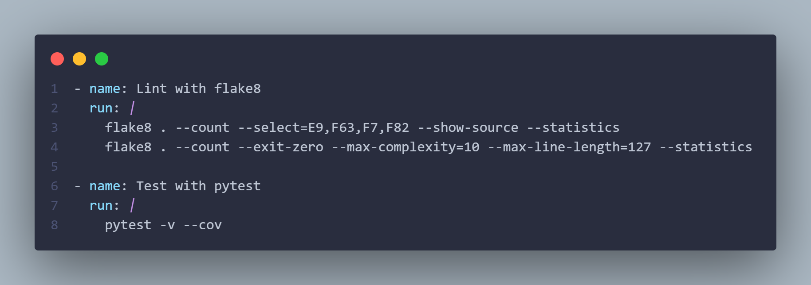

# Week 2

## Week 2 Plan

- <u>Python AT-Library</u> 
  - [Set-up](#set-up)
  - [To-do](#to-do)
  - [Notes](#notes)
  - [Sample Images](#sample-images)

## Python AT Library


## Set-up

First of all I configured my workspace

- Set up SSH extension for VSCode
- Create `AT-Lib` repository
- Add `AT-Lib` as submodule to this repository
- Create main directory structure for `AT-Lib`
  - Initialize tests and source directories
  - Add workflow folder for GitHub actions
    - Add linting and tests actions
    - [Sample image here](#workflow-snippet)

<br><hr>

## To-do

- Remove `pytest` comment line in [workflow](https://github.com/Alperencode/AT-Lib/blob/a8e9a2ebcf66b15230fe635df1f1a7c2c8d9ddf5/.github/workflows/python-app.yml#L43) after adding tests.

<br><hr>

## Notes

- To recursively update submodule 
  - ```$ git submodule update --recursive --remote```

<br><hr>

## Sample Images

### Workflow snippet

