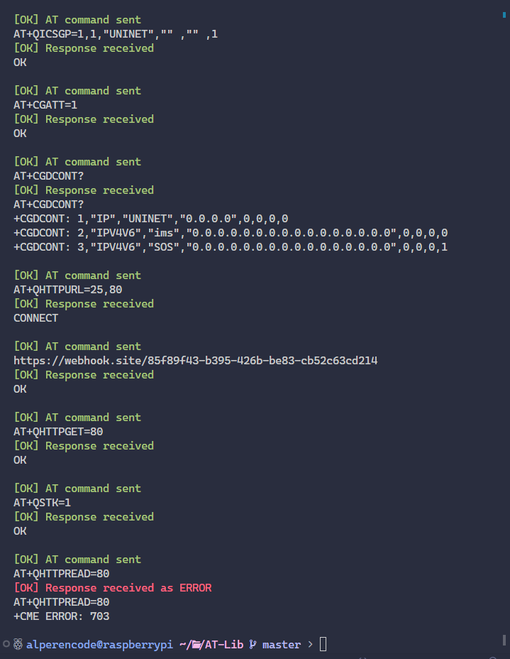
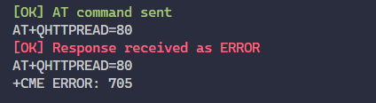

# Week 3

## Week 3 Plan

- <u>[Webhook Get-Post requests](#webhook-get-post-requests)</u>
  - [Process of Using HTTP(S) AT Commands](#process-of-using-https-at-commands)
  - [To-Do](#to-do)
  - [Input-Outputs](#input-outputs)
  - [Notes](#notes)
  - [Errors](#errors)
- <u>[Improving Python AT Library](#improving-python-at-library)</u>
  - [Minor-Updates](#minor-updates)

<hr>

# Webhook Get-Post requests

## Process of Using HTTP(S) AT Commands

- **STEP 1:** Configure `<APN>`, `<username>`, `<password>` and other parameters of a PDP context by AT+QICSGP. Please refer to [TCP(IP)_AT_Commands_Manual](https://sixfab.com/wp-content/uploads/2018/09/Quectel_EC2xEG9xEM05_TCPIP_AT_Commands_Manual_V1.0.pdf) for details. If QoS settings need to be updated, configure them by AT+CGQMIN, AT+CGEQMIN, AT+CGQREQ and AT+CGEQREQ commands. For more details, please refer to [AT_Commands_Manual](https://sixfab.com/wp-content/uploads/2018/09/Quectel_EC25EC21_AT_Commands_Manual_V1.2.pdf).

- **Step 2:** Activate the PDP context by AT+QIACT, then the assigned IP address can be queried by AT+QIACT?. Please refer to [TCP(IP)_AT_Commands_Manual](https://sixfab.com/wp-content/uploads/2018/09/Quectel_EC2xEG9xEM05_TCPIP_AT_Commands_Manual_V1.0.pdf) for details.

- **Step 3:** Configure the PDP context ID and SSL context ID by [AT+QHTTPCFG](https://sixfab.com/wp-content/uploads/2018/09/Quectel_EC2xEG9xEM05_HTTPS_AT_Commands_Manual_V1.0.pdf) command.

- **Step 4:** Configure SSL context parameters by AT+QSSLCFG command. For more details, please refer to [SSL_AT_Commands_Manual](https://usermanual.wiki/Document/QuectelEC2x26EG9x26EM05SSLATCommandsManualV10.1735503669/view).

- **Step 5:** Set HTTP(S) URL by [AT+QHTTPURL](https://sixfab.com/wp-content/uploads/2018/09/Quectel_EC2xEG9xEM05_HTTPS_AT_Commands_Manual_V1.0.pdf) command.

- **Step 6:** Send HTTP(S) request. [AT+QHTTPGET](https://sixfab.com/wp-content/uploads/2018/09/Quectel_EC2xEG9xEM05_HTTPS_AT_Commands_Manual_V1.0.pdf) command can be used for sending HTTP(S) GET request, and AT+QHTTPPOST or QHTTPOSTFILE command can be used for sending HTTP(S) POST request.

## To-do

- Add hyperlinks for all documents references in [Process of Using HTTP(S AT Commands)](#process-of-using-https-at-commands) ✔️
  - Gather up all command descriptions if necessary
- Try 3.2 (Access to HTTPS Server) in [HTTP(S) document](https://sixfab.com/wp-content/uploads/2018/09/Quectel_EC2xEG9xEM05_HTTPS_AT_Commands_Manual_V1.0.pdf) ✔️
  - Log errors (In [errors](#errors) section) ✔️
- Try different `apn` names ✔️
  - Used `UNINET` according to docs. ✔️
- Currently stuck on `703` and `705` errors.
  - 703 means https busy so if I try to send it by delaying it using, it returns error. Sometimes, the error appears to be `705`, and sometimes don't.

## Input-Outputs

With given input:
```python
request_commands = [
    'AT+CMEE=1',
    'AT+QHTTPCFG="contextid"',
    'AT+QHTTPCFG="responseheader",1',
    'AT+QICSGP=1,1,"UNINET","" ,"" ,1',
    'AT+CGATT=1',
    'AT+CGDCONT?',
    'AT+QHTTPURL=25,80',
    'https://webhook.site/85f89f43-b395-426b-be83-cb52c63cd214',
    'AT+QHTTPGET=80',
    'AT+QSTK=1',
    'AT+QHTTPREAD=80'
]
```

Output:



Sometimes it gives `705` error instead of `703`:



## Notes

- **AT+CGREG=?** is a test command that returns the list of supported network configurations.
- TCP and UDP protocol -> AT+QICSGP to configure the APN
- PPP protocol -> AT+CGDCONT to configure the APN


## Errors

- Faced `CME Error 705` which appears to be `SIM toolkit menu has not been configured` error (source [here](https://www.multitech.net/developer/wp-content/uploads/2010/03/S000474A.pdf)).
  - Solved by using `AT+QSTK=1` command (source [here](https://forums.quectel.com/t/at-command-for-interacting-with-stk-is-needed/25234))
- Faced `CME Error 703` error which appears to be `HTTP(S) Busy` (source [here](https://sixfab.com/wp-content/uploads/2018/10/Quectel_BG96_HTTPS_AT_Commands_Manual_V1.0.pdf))
  - Sometimes getting `+QHTTPGET: 707` along with `703` error which is appears to be `HTTP(S) Network open failed`
- Faced `+CME ERROR: 707` while trying `HTTPPOST` which appears to be `SIM toolkit not enabled` (source [here](https://www.multitech.net/developer/wp-content/uploads/2010/03/S000474A.pdf)).
> [!WARNING]
> Getting error while using AT+QICSGP command

<br>

##### Sources

- [Sixfab HTTP(S) AT Commands Manual](https://sixfab.com/wp-content/uploads/2018/09/Quectel_EC2xEG9xEM05_HTTPS_AT_Commands_Manual_V1.0.pdf)
- [Sixfab AT Commands Manual](https://sixfab.com/wp-content/uploads/2018/09/Quectel_EC25EC21_AT_Commands_Manual_V1.2.pdf)
- [Sixfab TCP/IP AT Commands Manual](https://sixfab.com/wp-content/uploads/2018/09/Quectel_EC2xEG9xEM05_TCPIP_AT_Commands_Manual_V1.0.pdf)
- [Sixfab GSM HTTP AT Commands Manual](https://sixfab.com/wp-content/uploads/2019/10/Quectel_GSM_HTTP_AT_Commands_Manual_V1.4.pdf)
- [Quectel SSL AT Commands Manual](https://usermanual.wiki/Document/QuectelEC2x26EG9x26EM05SSLATCommandsManualV10.1735503669/view)
- [AT+CGREG: Modes, parameters, and examples](https://onomondo.com/blog/at-command-cgreg/#overview)
- [What is the difference between CGDCONT and QICSGP?](https://forums.quectel.com/t/what-is-the-difference-between-cgdcont-and-qicsgp/152)
- [GPRS (General Packet Radio Services)](https://www.techtarget.com/searchmobilecomputing/definition/GPRS)

<br><hr>

# Improving Python AT Library

## Minor Updates

- Add `Empty OK response` check
  - Reference [here](https://github.com/Alperencode/AT-Lib/commit/0baa2ac691312461cc242cc6701e0d312f5957b4#diff-225e7cfc4be956dfc27a380f6db386cdd5c88abc9482236efcfc1b5dfa79f198R98)
- Add `CONNECT` response check
  - Reference [here](https://github.com/Alperencode/AT-Lib/commit/0baa2ac691312461cc242cc6701e0d312f5957b4#diff-225e7cfc4be956dfc27a380f6db386cdd5c88abc9482236efcfc1b5dfa79f198R109-R112) (Updated due testcases later [here](https://github.com/Alperencode/AT-Lib/commit/3a609c24e69418bdf78edfea4b78a8770458303c#diff-225e7cfc4be956dfc27a380f6db386cdd5c88abc9482236efcfc1b5dfa79f198R109-R112))
- Add return response to `Unexpected AT response`
  - Reference [here](https://github.com/Alperencode/AT-Lib/commit/0baa2ac691312461cc242cc6701e0d312f5957b4#diff-225e7cfc4be956dfc27a380f6db386cdd5c88abc9482236efcfc1b5dfa79f198R115)
- Reduced the delay time 
- Add clearing input and output buffers
  - Related commit [here](https://github.com/Alperencode/AT-Lib/commit/0aca446582c9c8dba5122187121611d0bedda31d)